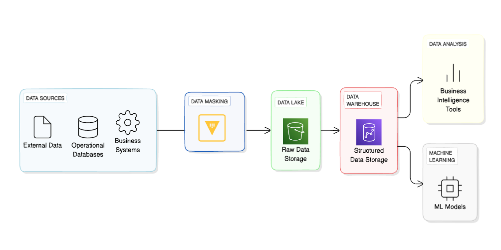

# Azure OpenAI Terraform deployment for sample chatbot

This sample application deploys an AI-powered document search using Azure OpenAI Service, Azure Kubernetes Service (AKS), and a Python application leveraging the [Llama index](https://gpt-index.readthedocs.io/en/latest/) ans [Streamlit](https://docs.streamlit.io/library/get-started). The application will be deployed within a virtual network to ensure security and isolation. Users will be able to upload documents and ask questions based on the content of the uploaded documents.



## Prerequisites

- Azure subscription. If you don't have an Azure subscription, [create a free account](https://azure.microsoft.com/free/?ref=microsoft.com&utm_source=microsoft.com&utm_medium=docs&utm_campaign=visualstudio) before you begin.
- Subscription access to Azure OpenAI service. Request Access to Azure OpenAI Service [here](https://customervoice.microsoft.com/Pages/ResponsePage.aspx?id=v4j5cvGGr0GRqy180BHbR7en2Ais5pxKtso_Pz4b1_xUOFA5Qk1UWDRBMjg0WFhPMkIzTzhKQ1dWNyQlQCN0PWcu).
- [Terraform](https://learn.microsoft.com/azure/developer/terraform/quickstart-configure).

- Create a HCP vault dedicated instance and configure the endpoint and token in the `infra/variables.tf` file.

## Quickstart

### Run the Terraform

- Clone or fork this repository. 
   ```
   git clone https://github.com/dawright22/azure-rag-terraform-deployment-demo.git
   cd azure-openai-terraform-quickstart
   ```

- Go to the `infra` folder and run the following command to initialize your working directory.

    ```bash
    cd infra
    terraform init
    ```

- Run terraform apply to deploy all the necessary resources on Azure.

    ```bash
    terraform apply
    ```
- Get the external ip address of the service by running the  command bellow.

    ```bash
    kubectl get services -n chatbot
    ```

- Copy the external ip address and paste it in your browser. The application should load in a few seconds.


## Run the AI.
- Upload the Madeup_Company_email_archive.txt file in the `data` folder. Using the upload button on the app.

- Ask some questions based on the content of the uploaded document. Some example are below.

================
- Does madeup use Azure
- Tell me the subscription_id


The application will return the answer to the question asked based on the content of the uploaded document. Any of the content from the Madeup_Company_email_archive.txt file source that matches the filter critera (ie Azure credentials) will be returned but encrypted via Vault.

## Clean up

- Terraform destroy to delete all resources created.

    ```bash
    terraform destroy
    ```
## Resources

- [Azure OpenAI](https://learn.microsoft.com/en-us/azure/cognitive-services/openai/overview)
- [Azure OpenAI Terraform verified module](https://registry.terraform.io/modules/Azure/openai/azurerm/latest).
